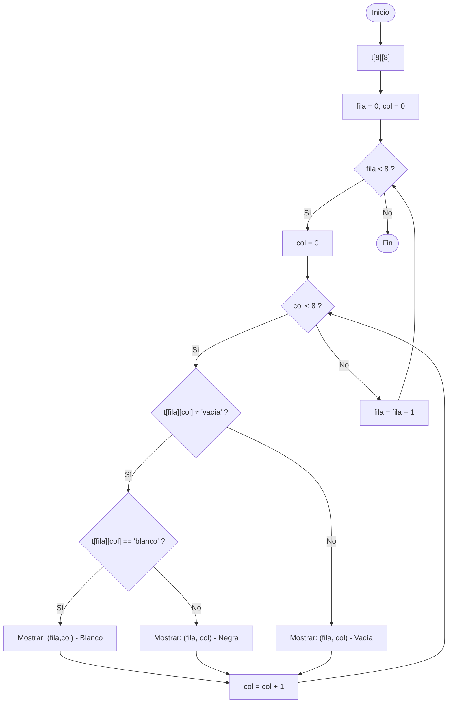
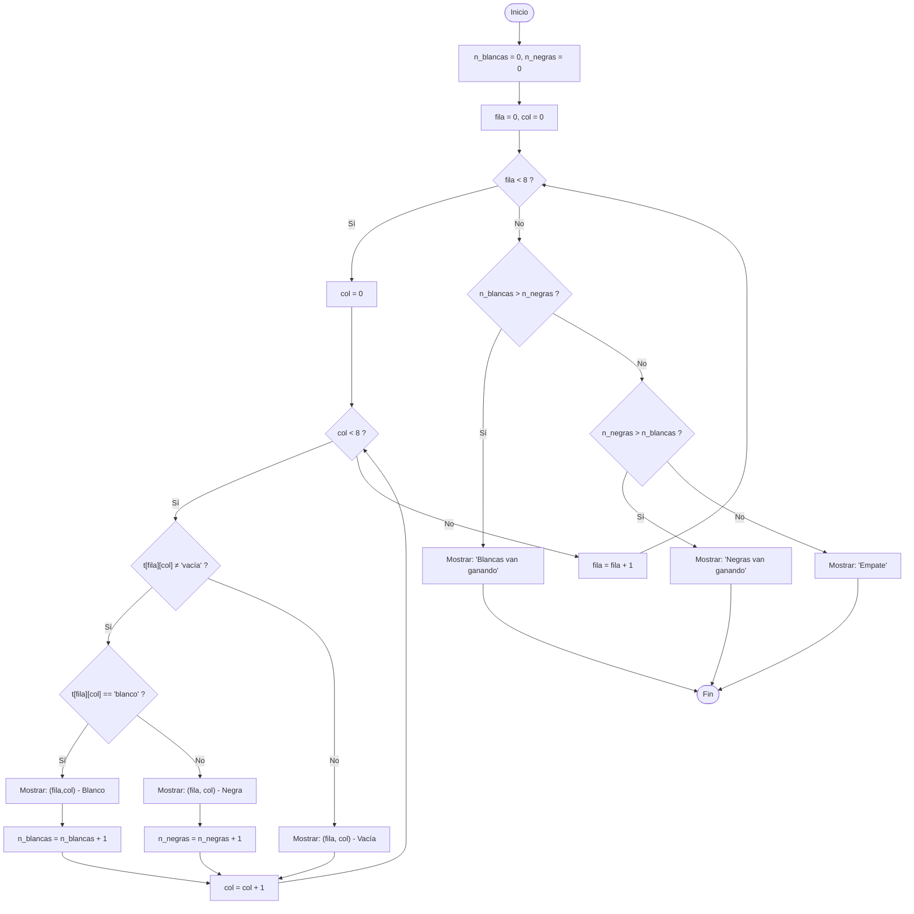

# Solución: Parte Diagramas

### Apartado 1: Recorrer tablero y mostrar estado de casillas 

### Apartado 2: Calcular quien va ganando

Inicializamos dos variables para contar las piezas blancas y negras (`n_blancas = 0, n_negras = 0`).

El diagrama es igual al anterior, después de la comprobación, después del `SI` de las fichas blancas y negras incrementamos los contadores (`n_blancas++; n_negras++`).

Al final del recorrido, antes del `FIN` comparamos los contadores y mostramos el resultado.

En el fichero [recorrerTablero.py](recorrerTablero.py) se encuentra la implementación en Python del segundo diagrama.

### Apartado 3: posibles funciones

1.- `contar_fichas_blancas(t)`: Cuenta y devuelve el número de fichas blancas en el tablero `t`.
2.- `contar_fichas_negras(t)`: Cuenta y devuelve el número de fichas negras en el tablero `t`.
3.- `vaGanando(t)`: Determina qué color de fichas va ganando en el tablero `t` y devuelve una cadena indicando el resultado ("Blancas van ganando", "Negras van ganando" o "Empate").
4.- `vaGanando2(blancas, negras)`: Similar a `vaGanando`, pero toma como parámetros el número de fichas blancas y negras en lugar del tablero completo. Devuelve una cadena indicando el resultado.
    
# Solución: Parte Depuración

### Apartado 1

Respuesta 1:
- 10

### Apartado 2

Pregunta 2.1:
- Valor de `aux`: 1
- Herramienta usada para entrar en la función: Step Into

Pregunta 2.2:
- Herramienta para salir rápidamente a la llamada: Step Out (Step Return)

Pregunta 2.3
- Diferencia entre Step Over y Step Into en `siguiente_numero = calcular_siguiente(serie)`:
   - Step Over: ejecuta la llamada completa sin entrar en la función.
   - Step Into: entra dentro de la función y permite depurar sus líneas internas.

### Apartado 3

Pregunta 3.1:
- Longitud de `serie` cuando el breakpoint condicional `siguiente_numero > 20000` se activa por primera vez: 23

Apartado 4 (no fue incluido en el examen)

Pregunta 4.1:
- Contenido final de `serie`: [0, 1, 1, 2, 3]
- Herramienta usada para modificar `n`: Ventana Variables de PyCharm (Set Value / Edit Value)

Preguntas 4.2:
- Si se cambia `n` después de que el bucle `while` ya terminó, no tiene efecto en el resultado final (el bucle ya se ejecutó con el valor anterior).
- Riesgo principal de modificar variables en tiempo de ejecución: puede enmascarar errores reales, producir resultados no reproducibles y llevar a conclusiones equivocadas sobre la lógica del programa.
